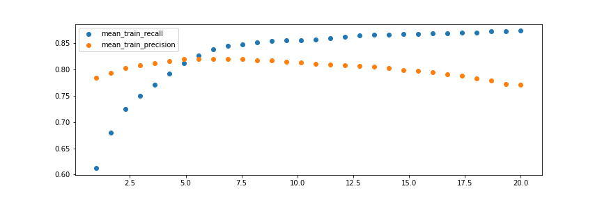

# 3 Metrics

1. [Importar librerías ](#schema1)

# 1. Importar librerías y cargar los datos

~~~python
import numpy as np
import pandas as pd
import matplotlib.pylab as plt

df  = pd.read_csv("./data/creditcard.csv")[:80_000]
~~~
### Obtener los train
~~~Python
X = df.drop(columns=['Time', 'Amount', 'Class']).values
y = df['Class'].values
~~~

# 2. LogisticRegression

~~~python
from sklearn.linear_model import LogisticRegression
mod = LogisticRegression(max_iter=1000)
mod.fit(X, y).predict(X).sum()
151
~~~

~~~python
mod = LogisticRegression(class_weight={0: 1, 1: 2}, max_iter=1000)
mod.fit(X, y).predict(X).sum()
171
~~~

# 3. GridSearchCV

~~~python
from sklearn.model_selection import GridSearchCV
from sklearn.metrics import precision_score, recall_score, make_scorer
~~~
Primera version del `GridSearchCV`
~~~Python
grid = GridSearchCV(
    estimator=LogisticRegression(max_iter=1000),
    param_grid={'class_weight': [{0: 1, 1: v} for v in range(1,4)]},
    cv=4,
    n_jobs=-1
)
grid.fit(X, y);
~~~

~~~python
from sklearn.metrics import precision_score, recall_score
~~~

~~~python
precision_score(y, grid.predict(X))
0.7682119205298014
recall_score(y, grid.predict(X))
0.5918367346938775
~~~
Añadimos los score al gridsearch
~~~python
grid = GridSearchCV(
    estimator=LogisticRegression(max_iter=1000),
    param_grid={'class_weight': [{0: 1, 1: v} for v in range(1,4)]},
    scoring={'precision': make_scorer(precision_score), 
             'recall': make_scorer(recall_score)},
    refit='precision',
    cv=4,
    n_jobs=-1
)
grid.fit(X, y)
plt.figure(figsize=(12, 4))
df_results = pd.DataFrame(grid.cv_results_)
for score in ['mean_test_recall', 'mean_test_precision']:
    plt.plot([_[1] for _ in df_results['param_class_weight']], 
             df_results[score], 
             label=score)
plt.legend()
plt.savefig("./images/recall_precision.png")
~~~

~~~Python
plt.figure(figsize=(12, 4))
df_results = pd.DataFrame(grid.cv_results_)
for score in ['mean_train_recall', 'mean_train_precision']:
    plt.scatter(x=[_[1] for _ in df_results['param_class_weight']], 
                y=df_results[score.replace('test', 'train')], 
                label=score)
plt.legend()
plt.savefig("./images/test_train.png")
~~~

# 4. Min(recall_score, precision_score)
~~~python
def min_recall_precision(y_true, y_pred):
    recall = recall_score(y_true, y_pred)
    precision = precision_score(y_true, y_pred)
    return min(recall, precision)

grid = GridSearchCV(
    estimator=LogisticRegression(max_iter=1000),
    param_grid={'class_weight': [{0: 1, 1: v} for v in np.linspace(1, 20, 30)]},
    scoring={'precision': make_scorer(precision_score), 
             'recall': make_scorer(recall_score),
             'min_both':make_scorer(min_recall_precision)},
    refit='min_both',
    return_train_score=True,
    cv=10,
    n_jobs=-1
)
grid.fit(X, y)
~~~

# 5. Uso de modelos de detección  Outlier

~~~python
from collections import Counter
from sklearn.ensemble import IsolationForest
mod = IsolationForest().fit(X)
Counter(mod.predict(X))
Counter({1: 76910, -1: 3090})
~~~

1:76910, la cantidad de no outlier
-1:3090 cantiade de outlier

Tenemos que usar otras funciones, porque las metricas anteriomente usadas solo aceptan los valores `0/1`

~~~python
def outlier_precision(mod, X, y):
    preds = mod.predict(X)
    return precision_score(y, np.where(preds == -1, 1, 0))

def outlier_recall(mod, X, y):
    preds = mod.predict(X)
    return recall_score(y, np.where(preds == -1, 1, 0))

grid = GridSearchCV(
    estimator=IsolationForest(),
    param_grid={'contamination': np.linspace(0.001, 0.02, 10)},
    scoring={'precision': outlier_precision, 
             'recall': outlier_recall},
    refit='precision',
    cv=5,
    n_jobs=-1
)
grid.fit(X, y);

plt.figure(figsize=(12, 4))
df_results = pd.DataFrame(grid.cv_results_)
for score in ['mean_test_recall', 'mean_test_precision']:
    plt.plot(df_results['param_contamination'], 
             df_results[score], 
             label=score)
plt.legend();
~~~

# 6. Documentación
Dataset: https://www.kaggle.com/mlg-ulb/creditcardfraud
https://www.youtube.com/watch?v=0B5eIE_1vpU&t=385s